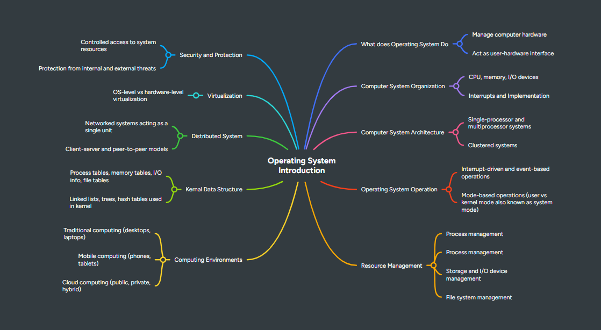

# Task 1 – Mind Maps for Chapter 1 & 2 📘🧠  
**Course:** Operating Systems 

##  Chapter 1: Introduction

- **What Operating Systems Do**
  - Interface between user and hardware
  - Resource management
  - Provides environment for application execution

- **Computer-System Organization**
  - CPU, memory, I/O devices
  - Buses and device controllers

- **Computer-System Architecture**
  - Single-processor
  - Multiprocessor
  - Clustered systems

- **Operating-System Operations**
  - Interrupt handling
  - Dual mode: user & kernel
  - Use of timers

- **Resource Management**
  - CPU, memory, file, and device management

- **Security and Protection**
  - Restricting unauthorized access
  - Data protection and system integrity

 
 **Link for mind map ** -https://mm.tt/map/3786416646?t=lqNeMc4dwi

 ## 🧠 Chapter 2: Operating-System Structures

### 📚 Key Concepts

- **OS Services**
  - Program execution
  - I/O operations
  - File management
  - Communication
  - Error detection

- **User & OS Interface**
  - CLI, GUI, voice/touch

- **System Calls**
  - Process, file, device control
  - POSIX, Win32, Java API

- **System Programs**
  - File tools, compilers, system status

- **Linkers & Loaders**
  - Linking object files
  - Loading into memory for execution

- **OS-Specific Applications**
  - Binary compatibility
  - OS-dependent interfaces

- **Design & Implementation**
  - OS goals
  - Mechanism vs. policy

- **OS Structure Types**
  - Monolithic
  - Layered
  - Microkernel
  - Modular
  - Hybrid

- **Booting the OS**
  - Bootstrap loader
  - GRUB and kernel loading

- **Debugging**
  - System logs
  - Kernel debuggers
